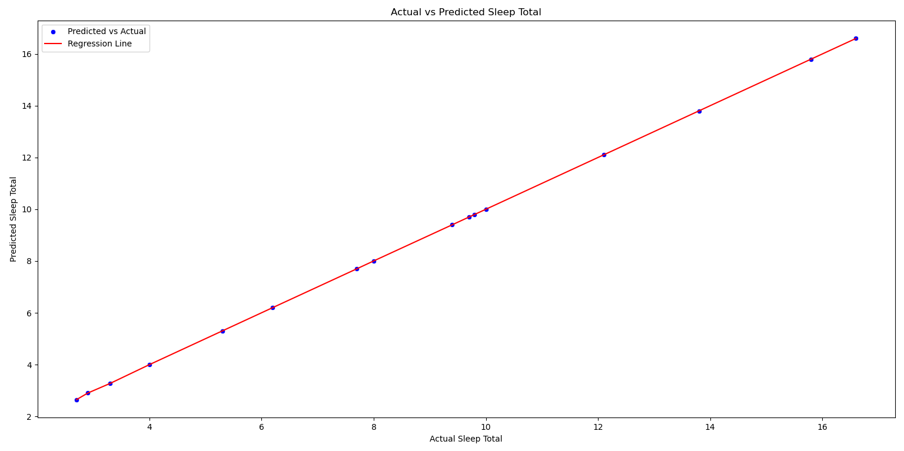

# Prediction Correlation Analysis

This project builds a **Linear Regression Model** to predict the total sleep time (`sleep_total`) of animals using data from the `msleep.csv` dataset. The model is trained on several biological features, and the prediction results are visualized with a **Scatter Plot and Regression Line**.

---

## Table of Contents
- [Dataset](#dataset)
- [Installation](#installation)
- [Usage](#usage)
- [Code Explanation](#code-explanation)
- [Results](#results)
- [Visualization](#visualization)
  - [Scatter Plot](#scatter-plot)


---

## Dataset
The `msleep.csv` dataset contains information about various animal species, including body and brain weight, sleep patterns, and dietary categories.

---

### Key Features:
- **bodywt**: Body weight of the animal
- **brainwt**: Brain weight of the animal
- **awake**: Time awake (in hours)
- **sleep_rem**: REM sleep time (in hours)
- **vore_carni**: Carnivorous animal (binary feature)
- **vore_herbi**: Herbivorous animal (binary feature)
- **vore_omni**: Omnivorous animal (binary feature)
- **vore_insecti**: Insectivorous animal (binary feature)

The **target variable** is `sleep_total`, which represents the total sleep time (in hours).

---

## Installation
1. Clone the repository:
   ```bash
   git clone https://github.com/barisgudul/PredictionCorrelationAnalysis.git
   cd PredictionCorrelationAnalysis

# Usage

## Prepare the Dataset
- Place the `msleep.csv` file in the project directory.

## Run the Code
- Execute the following command to train the Linear Regression Model and generate predictions:

```bash
python main.py
```
---

## Code Explanation

### 1. Data Loading and Imputation
- The data is loaded from `msleep.csv`.  
- Missing values are filled with the mean of their respective columns using `SimpleImputer`.

### 2. Feature and Target Selection
- **Independent Variables (X):** Biological features.  
- **Dependent Variable (y):** Total sleep time.

### 3. Data Splitting
- The dataset is divided into **80% training** and **20% test** sets using `train_test_split`.

### 4. Model Training
- A **Linear Regression Model** is trained on the training set.

### 5. Prediction and Visualization
- Predictions are made on the test data.  
- Results are visualized with a **scatter plot** and a **regression line**.

---

## Results

The following scatter plot displays the **predicted vs. actual sleep totals** for animals in the test set.  
A **regression line** is included to visualize the relationship between the predicted and actual values, indicating the model's performance.

---

## Visualization

```python
# Scatter plot and regression line
plt.figure(figsize=(15, 8))
sns.scatterplot(
    x=test_results["actual_sleep_total"], 
    y=test_results["predicted_sleep_total"], 
    label="Predicted vs Actual", 
    color="blue"
)
sns.lineplot(
    x=test_results["actual_sleep_total"], 
    y=test_results["predicted_sleep_total"], 
    color="red", 
    label="Regression Line", 
    linestyle="-"
)

plt.title("Actual vs Predicted Sleep Total")
plt.xlabel("Actual Sleep Total")
plt.ylabel("Predicted Sleep Total")
plt.legend()
plt.show()
```

---

### Scatter Plot

